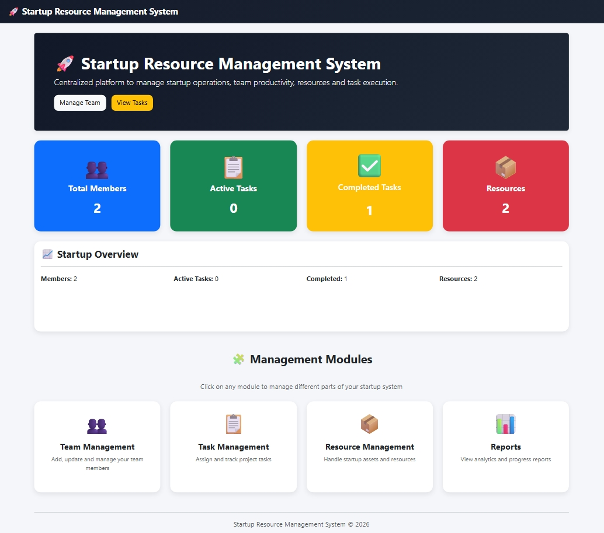
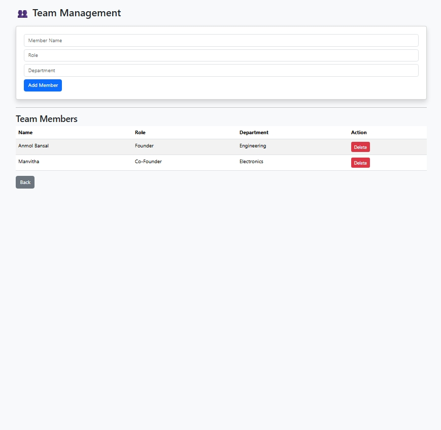
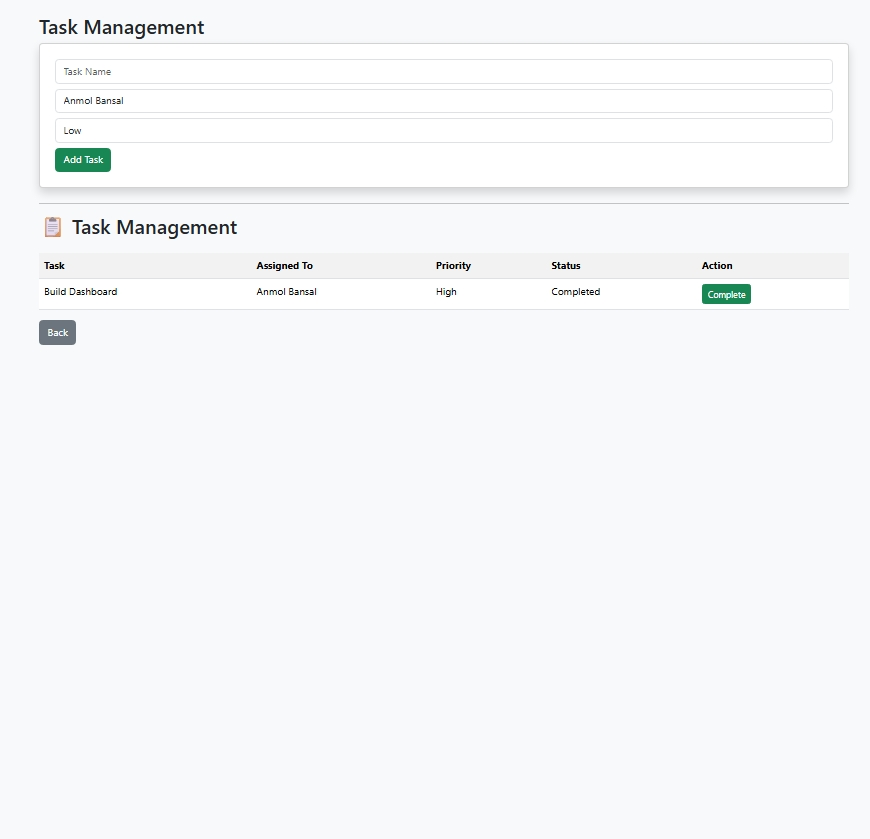
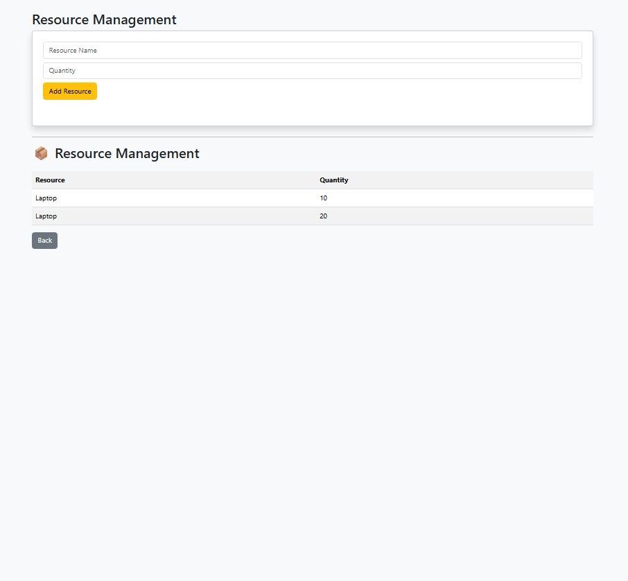
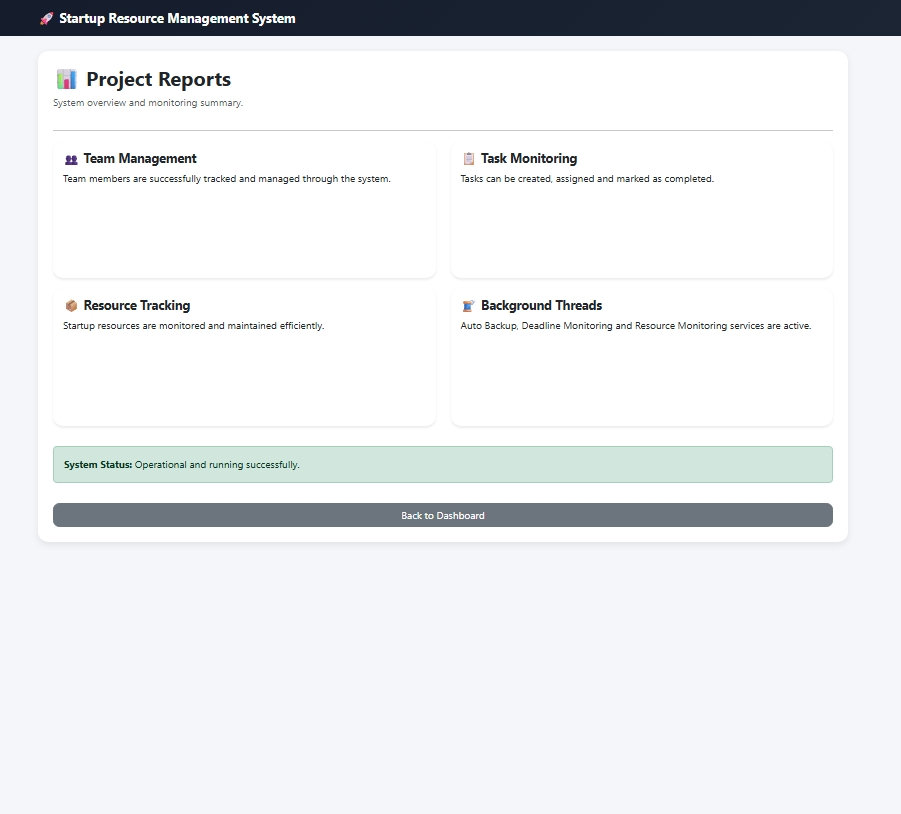

# 🚀 Startup Resource Management System (SRMS)

A professional web-based Startup Resource Management System built using **Flask, Python, Bootstrap, JSON storage, and multithreading**.  
It helps startups manage **team members, tasks, resources, and reports** through a centralized dashboard.

---

## 📸 Project Preview

### Dashboard

### Team Management

### Task Management

### Resource Management

### Reports

---

## 📌 Features

### 📊 Dashboard
- Total Team Members
- Active Tasks
- Completed Tasks
- Resource Availability
- Real-time statistics

### 👥 Team Management
- Add members
- View members
- Delete members
- Department & role tracking

### 📋 Task Management
- Create tasks
- Assign tasks to team members
- Set priority levels
- Mark tasks as completed
- Track task progress

### 📦 Resource Management
- Add resources
- Track availability
- Monitor usage

### 📈 Reports Module
- Project overview
- Team summary
- Task analysis
- Resource monitoring

---

## 🧵 Multithreading Features

This project uses Python threading for background operations:

- Auto backup system
- Deadline monitoring system
- Resource monitoring system

---

## 🛠️ Tech Stack

- Python
- Flask
- HTML5
- CSS3
- Bootstrap 5
- JSON (for data storage)
- Python Threading

---

## 📂 Project Structure
